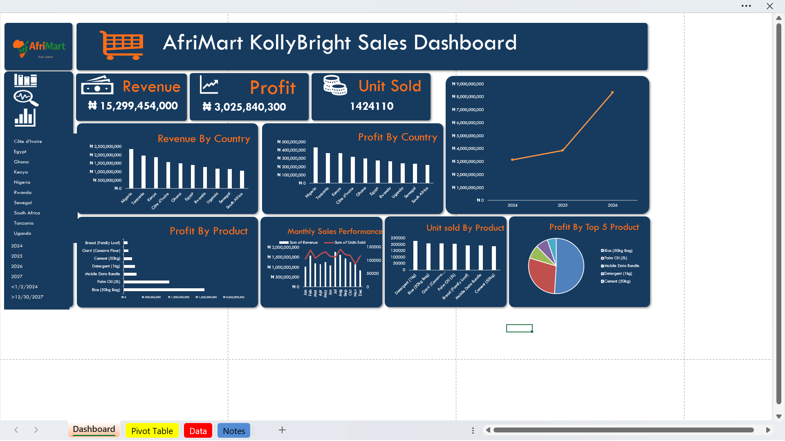

# 📊AfriMart_KollyBright_Sales_Dashboard
This project analyzes sales data for **AfriMart KollyBright**, a fictional African retail company. The goal of the dashboard is to management quckily understand sales performance, profitability and trends accross countries and products using Microsoft Excel

This project was created as part of a data analysis portfolio to demonstarte Excel dashboarding, data summarization and business insight skills.

---
## 🔍Business Questions Answered
- What is the total revenue, profit and unit sold?
- Which countries generate the highest revenue
- How does revenue change over time?
- Which Products perform best in different regions?
- Which Products are most profitable?
---

## 📈Key KPIs
- Total Profit
- Total Revenue
- Total Unit Sold
---

## ⚒️Tools Used
- Microsoft Excel
- Pivot Tables
- Pivot Charts
- Dashboard Design Techniques

---
## 📸Dashboard Preview

---
## 💡Key Insight
- Nigeria contributed the highest share of total revenue
- Some products recorded high sales volume but lower profit
- Revenue Trends show consistent growth over time
- Product performance varies significantly by country
---

## 📁Files in this Repository
- [Sales dataset](AfriMart_Sales_Dataset.xlsx)
- [Dashboard Screenshot](Afrimat_dashboard.png)
- [Company logo](logo_afrimart-logo.png)
- README.md
---

## 📍Conclusion
This project demonstrates how raw sales data can be transformed into clear, interactive dashboard that support data-driven business decisions. It highlights strong Excel fundamentals, analytical thinking and professional project documentation.

